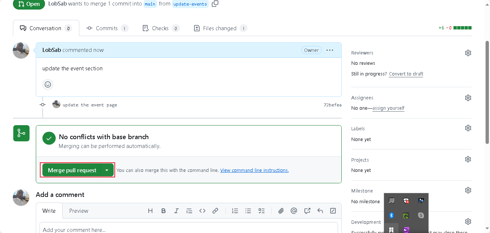

# greenwood-library-website
### Getting started

### Creating a New Branch called Add-Book-Reviews

### Add Book Reviews Branch

### Branch Pull Request

### Creating Pull Request by comparing both branches

### Merging Branch

### Book Branch Merged

### Creating a new branch called Update-branch

### Git pull request main initiated

### New Branch is created

### New Branch Pull Request Initiated

### New Branch Pull Request Created

### New Branch Merge Request

### NEw Branch Merged

### The GitHub Repo showing all branches
